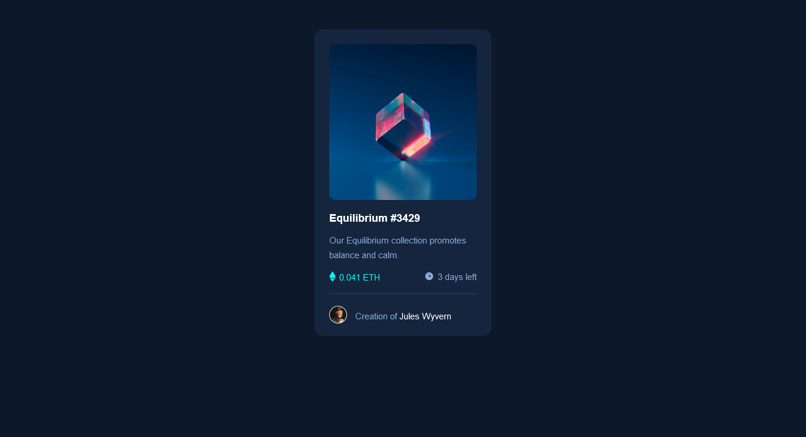

# Frontend Mentor - NFT preview card component solution

This is a solution to the [NFT preview card component challenge on Frontend Mentor](https://www.frontendmentor.io/challenges/nft-preview-card-component-SbdUL_w0U). Frontend Mentor challenges help you improve your coding skills by building realistic projects. 

## Table of contents

- [Overview](#overview)
  - [Screenshot](#screenshot)
  - [Links](#links)
- [My process](#my-process)
  - [Built with](#built-with)
  - [What I learned](#what-i-learned)
  - [Continued development](#continued-development)
  - [Useful resources](#useful-resources)
- [Author](#author)

## Overview

### The challenge

### Screenshot

The desktop design VS My desktop solution 
 

 

The mobile design VS My mobile solution 
 

### Links

- Solution URL: [FrontEnd Mentor: My Solution](https://www.frontendmentor.io/solutions/nft-preview-card-component-build-with-html-css-and-flexbox-9tuMXW3d2)
- Live Site URL: [GitHub Page: NFT preview card Component](https://richy55-max.github.io/NFT-preview-card-component/)

## My process

### Built with

- Semantic HTML5 markup
- CSS custom properties
- Flexbox

### What I learned

I learned to change image background-color on hover

### Continued development 

I want to continue incorporating new things I learn into my Frontend Mentor projects.

### Useful resources

- [Stackoverflow](https://stackoverflow.com/questions/33986068/change-image-background-color-on-hover) - This helped me for change background-color on hover. I really liked this pattern and will use it going forward.

## Author

- Frontend Mentor - [@Richy55-max](https://www.frontendmentor.io/profile/Richy55-max)
- CodePen - [@Kerekou](https://codepen.io/Kerekou)
- LinkedIn - [Arnaud Honfin](https://www.linkedin.com/in/arnaud-honfin-a71a9418a/)
- Twitter - [@arnaud_hf](https://twitter.com/arnaud_hf)

